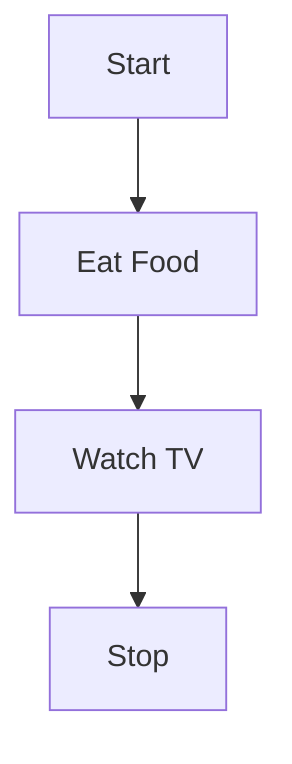
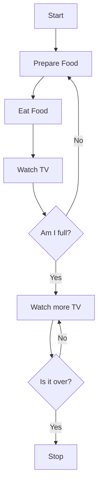

# FlowChartDemos

(Note: this is a Markdown document. You can edit and interact with it most easily using software that understands Markdown, such as [Visual Studio Code](https://code.visualstudio.com) or [Stack Edit](https://stackedit.io). Note that GitHub also displays Mermaid diagrams, including Activity Diagrams[Flow Charts] embedded in MarkDown documents.)

You can also see this document rendered on [GitHub](https://github.com/RBASOE-Class-Projects/FlowChartDemos/tree/main).

# Flow Charts (aka, UML Activity Diagrams without concurrency)

A flow chart is a diagram that describes a process in graphical terms. Each block in the diagram represents a state or activity. Lines connecting these activities represent transitions from one activity to another. The Unified Modeling Language (UML) is a standard for a variety of diagrams that describe the dynamic behavior of complex systems (e.g., software systems) and the UML Activity Diagram is one of the diagrams in the UML standard. The UML Activity diagram is a generalization of the concept of a Flow Chart to include more complex scenarios including concurrency.

Click the links below to find more details regarding activity diagrams:

[Description of an Activity Diagram](https://www.tutorialspoint.com/uml/uml_activity_diagram.htm)

[How do Flow Charts fit in UML?](https://www.visual-paradigm.com/guide/uml-unified-modeling-language/what-is-activity-diagram/)

There are many ways to create Flow Charts, including simple drawing tools like 
[Google Drawings](https://drawings.google.com) or [Diagram.net](https://www.diagrams.net/doc/faq/google-drive-diagrams). While these are fine for generating a quick diagram they don't work well in the context of larger software projects because they a difficult to integrate with version control systems like `git`. For text based version control systems it's more effective t use a text based Flow Chart system like [Plant Text](https://www.planttext.com) or [Mermaid](https://mermaid.js.org). If other formats are needed (e.g., html, word, tex, etc.) one can use a universal format converter such as [pandoc](https://pandoc.org) to tranlsate automatically.

Here is a simple example using Mermaid:

Which was produced by the Mermaid diagram description:

	flowchart TD
		A[Start] --> B[Eat Food]
		B --> C[Watch TV]
		C --> D[Stop]

You can also have conditions (diamonds):

from the code:

	flowchart TD
			A[Start] --> AA[Prepare Food]
			AA --> B[Eat Food]
			B --> C[Watch TV]
			C --> E{Am I full?}
			E --> |No| AA
			E --> |Yes| F[Watch more TV]
			F --> G{Is it over?}
			G --> |No | F
			G --> |Yes| D
			D[Stop]

Here is the same example using Plant Text:

[Example Plant Text Activity Diagram](https://www.planttext.com/?text=VL0x3i8m3Drz2i-ewW7eKYHWP071mcAQq4QaCOeD5RV7BKLiH5xYzxDTYrBMHny1v1OIPXOFe46ZnrMZuHdqXUj0RQOUpybO8nzWkI75BREh01Ahn-Yl2cZlq0L1AyATzSkodBgBdvlxk0asbF3YMqiTWdOcs4_UCpqXVHNcrd3aLA1mxt7WxAH0IiuqulimWNzZl77d456-m_WVnxP5JgHDXuTZDUvc4DG6sa7U)

with the code:

	@startuml
	skin rose
	
	title Activity Diagram \n
	
	start
	
	:Eat Food;
	
	note left
	    This is a Note...
	    * Activity diagrams can begin with a Start
	    * An activity is colon, some words, and a semicolon
	    * Activity diagrams can end with a stop
	end note
	
	:Watch TV;
	
	stop
	@enduml

Producing the diagram shown here:

While Plant Text has a richer set of options, and it produces more polished looking diagrams, it also requires an external process (a plant-text server) that has to be available to make it work. Mermaid, on the other hand, offers many "Plug Ins" that work with [VSCode](https://code.visualstudio.com), [pandoc](https://pandoc.org), and others to display diagrams embedded in Markdown documents dynamically as you edit.

After all you can pick from any of a number of strategies for creating and managing flowcharts to document the processes in your project. Use the approach that works best for you and your team.

